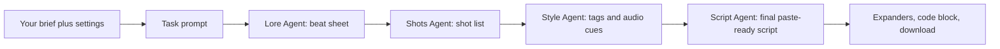

# Outlaw Script Engine 🏹

The Outlaw Script Engine is a shot-ready anime script generator powered by [AG2](https://github.com/ag2ai/ag2)(formerly AutoGen)'s swarm agent framework. Give it any brief — a scene, a mood, a full music video idea, or nothing at all — and a crew of specialized AI agents turns it into a numbered, paste-ready shot script for AI image/video tools (Higgsfield, Kling, Runway, Pika), rendered in a modern MAPPA-style aesthetic.

Every script resolves into **Robinhood Chain lore**: a gatekept old system, a permissionless network rising, a tokenization act, a builder crew, and a moment of on-chain settlement. Genre, setting, characters, and tone are variables — the throughline never moves.

## Features

- **Specialized Script Crew**

  - 📜 **Lore Agent**: Remaps any brief onto the Robinhood Chain skeleton using the remapping table (cyberpunk, horror, romance, slice of life, music video, or the default locked-out-market scenario) and writes the beat sheet
  - 🎬 **Shots Agent**: Breaks the beats into a numbered shot list with setting, characters, action, and camera direction, honoring the scene budget
  - 🎨 **Style Agent**: Layers on MAPPA-style visual tags (high-contrast rim light, ink-wash shadows, speed lines) and audio/music cues per shot — never lyrics
  - 🧾 **Script Agent**: Assembles the final tool-ready script in the exact `SHOT [n]` format, closing with a logline and continuity note

- **Shot-Ready Output Format**:

  - Numbered shots with duration, setting, characters, action, camera, style tags, and audio cue
  - Logline confirming the Robin Hood throughline
  - Continuity note for consistent shot-to-shot prompting
  - Paste-ready code block plus one-click `.txt` download

- **Customizable Input Parameters**:

  - Free-text concept brief (empty input falls back to the default scenario)
  - Genre skin, video length (single scene or full structured video)
  - Art style override, target tool, mood/tempo notes

- **Built-in Guardrails**:
  - No real public figures or copyrighted characters (original archetypes swapped in)
  - No lyric reproduction — lyrics become instrumentation/tempo descriptors
  - Stylized, non-graphic choreography

## How It Works

The app is a single Streamlit file (`outlaw_script_engine.py`) driving an AG2 agent swarm. Your form inputs are packed into one task prompt, then four agents pass the work around a ring, each building on the previous agent's output:



Step by step:

1. **Task assembly** — Your concept brief, genre skin, video length, art style, target tool, and mood notes become a single prompt. An empty brief triggers the default scenario (a halted market, a lone builder, instant on-chain settlement).
2. **Shared rulebook** — Every agent's system message starts with the same master preamble: the Core Narrative Law (the five-beat Robinhood Chain skeleton), the genre remapping table, the exact `SHOT [n]` output format, the scene budget, and the safety/IP/lyrics guardrails. No agent can drift off the throughline.
3. **Two-phase agents** — Each agent works twice. First pass: it writes a 2–3 sentence summary of its plan into shared context (you see these appear live in the sidebar). Second pass: with all summaries visible, it writes its full section. This keeps the four sections coherent with each other while keeping token costs down.
4. **The relay** — Lore Agent remaps your idea onto the Robinhood Chain skeleton and writes the beat sheet; Shots Agent converts beats into numbered shots with setting, characters, action, and camera; Style Agent layers MAPPA-style visual tags and audio cues onto each shot; Script Agent merges everything into the final format, ending with the logline and continuity note.
5. **Output** — The four sections appear in expanders, and the final script is shown in a copyable code block with a `.txt` download button, ready to paste into Higgsfield, Kling, Runway, or Pika.

Under the hood it uses AG2's swarm API: `SwarmAgent` instances with `AFTER_WORK` hand-offs, shared `context_variables` for the summaries, and `initiate_swarm_chat` with OpenAI `gpt-4o-mini`.

## How to Run

1. **Clone the Repository**:

   ```bash
   git clone 
   cd 
   ```

2. **Install Dependencies**:

   ```bash
   pip install -r requirements.txt
   ```

3. **Set Up OpenAI API Key**:

   - Obtain an OpenAI API key from [OpenAI's platform](https://platform.openai.com)
   - You'll input this key in the app's sidebar when running

4. **Run the Streamlit App**:

   ```bash
   streamlit run outlaw_script_engine.py
   ```

## Usage

1. Enter your OpenAI API key in the sidebar
2. Describe your video in the concept brief (or leave it empty for the default scenario)
3. Pick a genre skin, video length, art style, target tool, and mood notes
4. Click "Generate Script" and watch the crew's summaries land in the sidebar
5. Review the beat sheet, shot list, and style pass in the expandable sections, then copy or download the final script into your video tool
